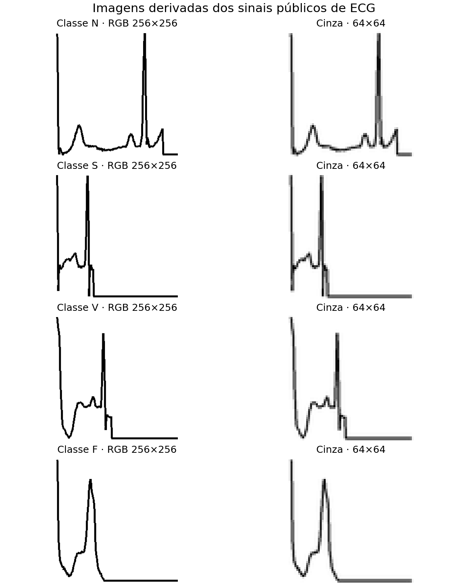

# FIAP - Faculdade de Informática e Administração Paulista


# CardioIA — Fase 2: Diagnóstico Automatizado (IA no Estetoscópio Digital)

Protótipo acadêmico que analisa relatos de sintomas por dois métodos: extração de
expressões associadas a possíveis doenças e classificação de frases em alto ou baixo
risco com aprendizado de máquina.

Projeto acadêmico — FIAP, 2º ano de Inteligência Artificial.

> As bases são sintéticas, os rótulos foram atribuídos por estudantes e as associações
> não foram validadas clinicamente. As saídas demonstram o funcionamento dos métodos e
> não devem ser utilizadas para diagnóstico ou triagem de pacientes.

## 👨‍🎓 Integrantes
- [CAUAN OTTO RODRIGUES SOUSA (RM567940)](https://www.linkedin.com/in/cauanotto)
- [FERNANDO A GURGEL (RM567606)](https://www.linkedin.com/in/fernando-gurgel-75aa8369)
- [IRACI MONTEIRO SOUZA (RM567544)](https://www.linkedin.com/in/iraci-souza-bab42034)
- [MARIA LUISA RODRIGUES NASCIMENTO (RM567659)](https://www.linkedin.com/in/malu-rodrigues-bb756b271)
- [RAFAELA TORRES MARTINS (RM567735)](https://www.linkedin.com/in/rafaela-torres222)


- **Tutor(a):** Leonardo Ruiz Orabona
- **Coordenador(a):** [ANDRÉ GODOI](https://www.linkedin.com/in/andregodoichiovato)

## 🎥 Vídeo de demonstração

**Vídeo ainda não publicado.** Após a gravação, incluir aqui o link do YouTube em
visibilidade **não listado**, conforme o enunciado.

Vídeo de até 4 minutos com a execução completa da solução: leitura dos relatos e do mapa
de conhecimento, extração de sintomas e sugestão de diagnóstico (Parte 1), e treinamento,
avaliação e teste do classificador de risco (Parte 2). O roteiro está em
[docs/roteiro_video.md](docs/roteiro_video.md).

## Entregáveis e organização

| Arquivo | Finalidade |
|---|---|
| [dados/frases_pacientes.txt](dados/frases_pacientes.txt) | 10 relatos, um por linha, com sintomas, início e impacto na rotina |
| [dados/mapa_conhecimento.csv](dados/mapa_conhecimento.csv) | 48 associações entre expressões de sintomas e possíveis doenças |
| [src/extracao_sintomas.py](src/extracao_sintomas.py) | Leitura dos arquivos, extração, pontuação e exportação |
| [notebooks/01_extracao_sintomas.ipynb](notebooks/01_extracao_sintomas.ipynb) | Demonstração comentada da Parte 1 |
| [dados/resultado_extracao.csv](dados/resultado_extracao.csv) | Resultados dos 10 relatos |
| [dados/frases_risco.csv](dados/frases_risco.csv) | 80 frases rotuladas para classificação de risco |
| [notebooks/02_classificador_risco.ipynb](notebooks/02_classificador_risco.ipynb) | Treinamento, comparação de modelos e avaliação da Parte 2 |
| [dados/resultado_classificador.csv](dados/resultado_classificador.csv) | Acurácias e estatísticas de validação cruzada |
| [dados/metricas_cv_agregada.csv](dados/metricas_cv_agregada.csv) | Matriz de confusão agregada e métricas por classe da validação cruzada |
| [docs/GOVERNANCA_FASE2.md](docs/GOVERNANCA_FASE2.md) | Proveniência, limitações e discussão de vieses |
| [requirements.txt](requirements.txt) | Dependências para instalação |
| [requirements-testadas.txt](requirements-testadas.txt) | Versões dos pacotes usadas na execução de validação |
| [abrir_notebooks.bat](abrir_notebooks.bat) e [executar_extracao.bat](executar_extracao.bat) | Atalhos de execução no Windows, após preparar o ambiente |
| [docs/roteiro_video.md](docs/roteiro_video.md) | Roteiro do vídeo de demonstração |

Os notebooks possuem saídas salvas. Para reproduzir o projeto, baixe ou clone o
repositório completo, mantendo as pastas `dados/`, `src/` e `notebooks/`.
Os dois notebooks importam funções de `src/extracao_sintomas.py`.

## Como executar

Use **Python 3.13**, versão usada na validação. `requirements.txt` referencia
`requirements-testadas.txt`, que fixa os pacotes: NumPy 2.3.5, pandas 2.3.3,
scikit-learn 1.8.0, JupyterLab 4.5.4 e ipykernel 7.2.0. O Python validado é 3.13.7.

A versão do scikit-learn importa: a 1.8 corrigiu a divisão por grupos com embaralhamento.
Versões anteriores podem gerar divisões e métricas diferentes com a mesma semente.
Veja as [notas da versão 1.8](https://scikit-learn.org/1.8/whats_new/v1.8.html#sklearn-model-selection).

```bash
git clone https://github.com/fiap-ia-trabalho/2ano_cardioia-fase2-estetoscopio-digital.git
cd 2ano_cardioia-fase2-estetoscopio-digital
python -m venv .venv
```

Ative o ambiente: no PowerShell, use `.\.venv\Scripts\Activate.ps1`; no
macOS/Linux, use `source .venv/bin/activate`. Depois:

```bash
python -m pip install -r requirements.txt
python -m ipykernel install --prefix .venv --name cardioia-fase2 --display-name "CardioIA Fase 2 (.venv)"
```

Execute a Parte 1 a partir da raiz do projeto:

```bash
python src/extracao_sintomas.py
```

O script lê os relatos e o mapa, mostra as sugestões no terminal e grava
`dados/resultado_extracao.csv`.

Para executar os notebooks:

```bash
python -m jupyterlab notebooks/
```

Abra cada notebook, escolha o kernel **CardioIA Fase 2 (.venv)**, reinicie o kernel e
execute todas as células em ordem. A Parte 2
grava `dados/resultado_classificador.csv` e `dados/metricas_cv_agregada.csv`. A execução substitui os respectivos CSVs de
resultados.

No Windows, após preparar o ambiente, também é possível abrir o JupyterLab com
um duplo clique em `abrir_notebooks.bat` e executar a Parte 1 com
`executar_extracao.bat`. Os dois atalhos utilizam o Python da pasta `.venv`.

O projeto utiliza NumPy, pandas, scikit-learn, JupyterLab e ipykernel. As matrizes de confusão são tabelas,
sem dependência de uma biblioteca de gráficos.

## Continuidade com a Fase 1

Repositório anterior: [Batimentos de Dados](https://github.com/fiap-ia-trabalho/2ano_cardioia-fase1-batimentos-de-dados).

- **Corpus textual:** a coluna `origem` registra 15 linhas atribuídas ao texto de
  síndrome coronariana, uma ao texto de hipertensão e 32 a `conhecimento_geral_equipe`.
  Essa identificação registra a procedência declarada pela equipe; não equivale a
  validação clínica da associação ou de seu peso.
- **Base numérica:** `cardio_train_amostra_100` não foi utilizada nesta implementação.
  O classificador recebe frases sintéticas, sem integração com as variáveis tabulares.
- **Base de imagens:** não foi utilizada, pois os métodos implementados trabalham com texto.

## Ir Além 1 — Portal de atendimento

O desafio adicional está no repositório público
[CardioIA Portal](https://github.com/fiap-ia-trabalho/fiap-ia-trabalho-cardioia-portal).
Ele contém a interface React com login simulado, pacientes, agendamentos e dashboard,
com instruções de execução e roteiro para seu próprio vídeo de demonstração.
O portal usa dados fictícios e não integra os modelos de texto desta entrega.

## Parte 1 — Extração de sintomas

### Dados e método

As 10 frases simulam relatos de pacientes e incluem variações de acentuação e maiúsculas.
O mapa contém 48 linhas e 96 expressões, distribuídas em sete condições: Infarto Agudo
do Miocárdio, Angina, Insuficiência Cardíaca, Arritmia, Hipertensão Arterial, Pericardite
e Acidente Vascular Cerebral.

| Coluna | Significado |
|---|---|
| `sintoma_1` e `sintoma_2` | Expressões pesquisadas nos relatos |
| `doenca_associada` | Hipótese associada pela regra didática |
| `peso` | Pontuação de 1 a 3 definida pela equipe, sem calibração clínica |
| `origem` | Procedência declarada da expressão |

O processamento segue quatro etapas:

1. Normaliza relato e expressões: remove acentos, converte para minúsculas e limpa
   pontuação e espaços.
2. Procura cada expressão como trecho do relato, começando pelas mais longas.
3. Descarta um termo inteiramente contido em outro trecho já reconhecido. Isso evita
   somar `falta de ar` ao mesmo trecho de `falta de ar quando deito`.
4. Soma os pesos por doença e apresenta a mais pontuada. Sem correspondências ou com
   empate na maior pontuação, retorna `Inconclusivo - encaminhar para avaliação humana`.

**A coluna `confianca` não é uma probabilidade de doença.** Ela contém a pontuação da
hipótese mais pontuada dividida pela soma de todas as pontuações. Um valor de 100% pode
resultar de uma única expressão associada a uma única condição no mapa.

### Resultados e testes adicionais

Os 10 relatos geram sugestões, sem resultados inconclusivos. Como frases e mapa foram
construídos pela mesma equipe, sem gabarito clínico independente, isso demonstra
funcionamento, não acurácia diagnóstica validada.

A seção 8 do notebook contém **quatro testes adicionais**:

| Caso | Saída observada | Interpretação |
|---|---|---|
| Tornozelo torcido ao jogar bola | Inconclusivo | Nenhuma expressão encontrada |
| Coração fica acelerado, falta de ar e subida de escada | Angina, proporção de pontuação de 60% | Não reconhece a variante `coração fica acelerado` |
| Dor de garganta e febre | Inconclusivo | Nenhuma expressão encontrada |
| Peso no peito e suor frio | Infarto Agudo do Miocárdio, proporção de pontuação de 100% | Correspondência com as regras; não confirma a doença |

O segundo teste expõe uma falha de extração: a palavra intermediária `fica` impede a
correspondência com `coração acelerado`. Ele não estabelece o diagnóstico clínico correto.

### Limitações da extração

- Não interpreta negação, hipótese, tempo do evento ou quem apresenta o sintoma.
  `Não sinto dor no peito` ainda corresponde a `dor no peito`.
- Expressões genéricas, como `subo a escada` e `respiro fundo`, podem gerar pontuação
  mesmo sem relato de desconforto.
- A regra de sobreposição não elimina sinônimos em trechos distintos: `dor no peito`
  e `dor torácica` podem ser contados separadamente no mesmo relato.
- Variantes como `palpitações` podem não ser reconhecidas.
- Um relato de condição fora das sete categorias pode receber uma sugestão incorreta
  se contiver uma expressão do mapa. Estar fora da cobertura não garante saída inconclusiva.

## Parte 2 — Classificação de risco

### Dados, representação e divisão

A base possui **80 frases sintéticas**, 40 de alto risco e 40 de baixo risco, em
**40 grupos semânticos**. As colunas são `frase`, `situacao` e `grupo_semantico`.
Há vocabulário compartilhado entre as classes; uma palavra como `peito` não determina
sozinha o rótulo atribuído pela equipe.

O texto é convertido em atributos por TF-IDF com unigramas, bigramas e a normalização
da Parte 1. Regressão logística e árvore de decisão são avaliadas em pipelines que
ajustam o TF-IDF somente nos dados de treinamento de cada divisão.

A avaliação principal usa `StratifiedGroupKFold`, mantendo cada grupo inteiro em um
único lado da divisão e buscando preservar a proporção das classes. Isso reduz o risco
de testar o modelo sobre variações muito próximas das frases usadas no treinamento.

### Resultados

| Modelo | Acurácia no teste isolado | Acurácia média na validação cruzada por grupo |
|---|---:|---:|
| Regressão logística | 90,0% | 77,5% ± 5,0 pontos percentuais |
| Árvore de decisão | 70,0% | 63,75% ± 8,29 pontos percentuais |
| Regra por palavras-chave | 60,0% | 58,75% ± 23,58 pontos percentuais |

O teste isolado usa 60 frases para treinamento e 20 para teste. A validação cruzada
avalia cinco divisões da base. O valor após `±` é o desvio-padrão das acurácias entre
divisões, não um intervalo de confiança.

**Comparação equivalente:** a regra por palavras-chave foi avaliada nas mesmas cinco
divisões por grupo (seção 8.1 do notebook 02). Na média, a regressão logística a supera em
**18,75 pontos percentuais** (77,5% contra 58,75%); no teste isolado, a diferença é de
30 pontos (90% contra 60%). O desvio-padrão alto da regra (23,58 pontos, com divisões
entre 18,75% e 87,5%) mostra que seu acerto depende muito de quais frases caem no teste.

### Matriz de confusão do teste isolado

| Rótulo da base / Previsão | Alto risco | Baixo risco |
|---|---:|---:|
| Alto risco | 10 | 0 |
| Baixo risco | 2 | 8 |

Houve zero falsos negativos e dois falsos positivos **nessa divisão**. Isso não garante
o mesmo comportamento em outras divisões ou em novos dados.

### Avaliação agregada das cinco divisões

A seção 8.1 do notebook 02 reúne as previsões de teste das 80 frases, usando a mesma
regressão logística e as mesmas divisões por grupo da validação cruzada. Cada frase foi avaliada
por um modelo treinado sem o seu grupo.

| Rótulo da base / Previsão | Alto risco | Baixo risco |
|---|---:|---:|
| Alto risco | 30 | 10 |
| Baixo risco | 8 | 32 |

A acurácia foi de **77,5%**. Para alto risco, a sensibilidade foi de **75%** (30/40),
a precisão de **78,9%** (30/38) e o F1 de **76,9%**. Houve **10 falsos negativos e
8 falsos positivos**, tomando os rótulos sintéticos da equipe como referência.

Esses números são exportados em `dados/metricas_cv_agregada.csv`.

### Comparação entre divisões por grupo e por frase

O notebook também avalia a regressão logística dividindo por frase, como comparação:

| Divisão | Acurácia média |
|---|---:|
| Por grupo semântico | 77,50% |
| Por frase | 83,75% |
| Diferença observada | 6,25 pontos percentuais |

O resultado por frase é mais otimista nesta base. É compatível com o risco de
compartilhar variações semelhantes entre treino e teste, mas a diferença isolada não
mede uma contribuição causal exclusiva de vazamento. As estratégias também alteram
a dificuldade e a composição dos conjuntos de avaliação.

## Ir Além 2 — Imagens de ECG e rede neural MLP

O [notebook 03](notebooks/03_diagnostico_visual.ipynb) classifica imagens de batimentos
derivadas da [base recomendada pela FIAP](https://www.kaggle.com/datasets/shayanfazeli/heartbeat),
versão 1. A base fornece CSVs, enquanto o enunciado descreve imagens. Nossa adaptação
é explícita: desenhamos o sinal em RGB 256×256, convertemos para cinza e redimensionamos
para 64×64. **A rede recebe os pixels das imagens**, normalizados e achatados com Flatten.
São traçados derivados dos sinais públicos, sem serem fotografias de exames completos.



### Dados, divisão e arquitetura

- Cada linha tem 187 amplitudes temporais e um rótulo. Os sinais já vêm segmentados,
  reamostrados e preenchidos com zeros pela preparação da base.
- N (código 0) é o grupo normal definido na base; S/V/F (1/2/3) compõem o grupo alterado.
  Q (4), de batimentos não classificados, é excluída. Isso não diagnostica a saúde de uma pessoa.
- A amostra de trabalho tem 6.000 batimentos de cada classe: **9.600 para treino e
  2.400 para validação**. A seleção e a divisão usam semente 42.
- O teste usa o arquivo separado `mitbih_test.csv`, com **20.284 batimentos** após excluir Q,
  preservando a distribuição dos rótulos restantes. Não representa prevalência clínica.
- O notebook verifica duplicatas exatas e documenta sua contagem; nesta execução,
  houve zero duplicatas/conflitos excluídos do pool de treino e zero duplicatas de
  treino/validação excluídas do teste. O CSV não permite verificar separação por paciente.
- A MLP Keras usa Dense 128 → 64 → 32, ReLU, Dropout 0,3/0,2 e saída Sigmoid.
  Adam e binary cross-entropy treinam por dez épocas fixas, com lotes de 64.
  O limiar de decisão é 0,5, definido antes da avaliação final.

### Executar o Ir Além 2

Depois de criar e ativar `.venv` como explicado acima:

```bash
python -m pip install -r requirements-ir-alem2.txt
python -m ipykernel install --prefix .venv --name cardioia-ecg --display-name "CardioIA ECG (.venv)" --env PYTHONHASHSEED 0
python src/baixar_ecg.py
python src/executar_ir_alem2.py
```

O ambiente validado usa Python 3.13.7, TensorFlow 2.21.0, Keras 3.15.1, h5py 3.14.0,
ml_dtypes 0.6.0, Pillow 12.0.0 e Matplotlib 3.10.7, além das versões fixadas da entrega
principal. O treinamento usa CPU e uma thread. O script executa o notebook inteiro em
ordem e salva as saídas quando todas as células terminam sem erro.

O download mantém `dados/mitbih_train.csv.gz` e `dados/mitbih_test.csv.gz`, com compressão
sem perdas. Os hashes são conferidos contra [ecg_origem.json](dados/ecg_origem.json).
Também é possível baixar a versão 1 manualmente e colocar os dois CSVs sem compressão
em `dados/`. O notebook aceita ambos os formatos; não procura na pasta errada de execução.
Os arquivos grandes e `modelos/cardioia_ecg.keras` ficam fora do Git.

Para abrir no JupyterLab, use `abrir_ir_alem2.bat` no Windows ou
`python -m jupyterlab notebooks/03_diagnostico_visual.ipynb`. Confira o kernel
**CardioIA ECG (.venv)**. O atalho `executar_ir_alem2.bat` prepara a base e refaz a execução.

### Resultados verificados em 07/10/2026

| Medida | Resultado |
|---|---:|
| Acurácia da validação, conferida com a última época | 93,79% |
| Acurácia do teste separado | **95,34%** |
| Precisão do grupo S/V/F | 72,03% |
| Recall do grupo S/V/F | **92,15%** |
| F1 do grupo S/V/F | 0,8086 |
| Taxa de falsos positivos entre os N | 4,28% |
| Fração de alertas incorretos entre as previsões S/V/F | 27,97% |
| Referência que sempre prevê N: acurácia / recall S/V/F | 89,32% / 0% |

| Rótulo da base / Previsão | N | S/V/F |
|---|---:|---:|
| N | 17.343 | 775 |
| S/V/F | 170 | 1.996 |

Houve **775 falsos positivos e 170 falsos negativos**. Precisão de 72,03% significa
que essa fração dos alertas S/V/F coincide com o rótulo da base. Seu complemento,
27,97%, é a fração de alertas incorretos; a taxa de falsos positivos entre os N
é outra medida, de 4,28%. Esses denominadores não são intercambiáveis.

Os valores vêm de [ecg_resultados.json](dados/ecg_resultados.json),
[métricas por classe](dados/ecg_metricas_classes.csv),
[matriz de confusão](dados/ecg_matriz_confusao.csv) e
[histórico de treino](dados/ecg_historico.csv). A última acurácia da validação foi
conferida com a avaliação do modelo atual. Salvar e recarregar o modelo preservou
as previsões verificadas. Duas execuções completas com semente 42 e
`PYTHONHASHSEED=0` produziram as mesmas métricas e matriz de confusão nesta máquina;
a conferência está em [ecg_reproducao.json](dados/ecg_reproducao.json).
Isso não promete reprodução idêntica em outros ambientes.
[ecg_divisao.csv](dados/ecg_divisao.csv) identifica as linhas
usadas; [exemplos_ecg](dados/exemplos_ecg) contém as imagens e sua origem.

### Limitações e vídeo

A perda da validação oscilou e terminou acima de seu menor valor, enquanto a perda
de treino caiu; os gráficos mostram um sinal compatível com sobreajuste. Dropout
não comprova sua eliminação. Não avaliamos calibração, pacientes independentes,
fotografias clínicas nem generalização para outros equipamentos. Boa acurácia
não garante segurança clínica. Consulte [governança do Ir Além 2](docs/GOVERNANCA_IR_ALEM2.md).

**Vídeo do Ir Além 2 ainda não publicado.** Incluir aqui seu link do YouTube como
não listado, com até quatro minutos. O [roteiro](docs/roteiro_video_ir_alem2.md)
mostra quais telas, código, imagens e resultados apresentar. Esta demonstração
é adicional ao vídeo da entrega principal e ao vídeo do portal.

## Interpretação, vieses e governança

O documento [GOVERNANCA_FASE2.md](docs/GOVERNANCA_FASE2.md) registra a discussão da
equipe. A interpretação dos resultados exige as seguintes distinções:

- **Estilo de escrita:** termos como `quando`, `depois`, `da` e `um` favorecem baixo
  risco. Isso sugere sensibilidade a padrões de redação, mas os coeficientes sozinhos
  não quantificam quanto da acurácia decorre desses padrões.
- **Sinal dos coeficientes:** a ordem observada é `['alto risco', 'baixo risco']`.
  Coeficientes positivos favorecem baixo risco; negativos favorecem alto risco.
  As listagens de termos do código e o texto da seção 11 do notebook 02 usam essa
  interpretação.
- **Negação:** `nao` contribui para alto risco no modelo treinado, mas a decisão combina
  todos os atributos. Seu coeficiente não determina sozinho a previsão de uma frase.
  Bigramas capturam algumas combinações, sem garantir interpretação geral de negação.
- **Probabilidades:** nos seis exemplos novos, as estimativas de alto risco ficaram
  entre aproximadamente 35% e 64,3%. A faixa, sozinha, não comprova descalibração.
  A calibração não foi avaliada e as estimativas não representam risco clínico validado.
- **Representatividade:** os relatos foram escritos pela equipe. Não há avaliação
  externa nem dados estruturados de subgrupos para medir diferenças por idade, região
  ou escolaridade. Desvantagens para esses grupos são riscos a investigar, não
  resultados demonstrados pelo experimento.
- **Rótulos e pesos:** foram definidos pela equipe, sem revisão clínica. A avaliação
  mede concordância com esses rótulos, cuja qualidade limita as conclusões.
- **Privacidade:** as bases de relatos não contêm dados de pacientes reais. Isso não
  constitui uma implementação de controles de proteção de dados para uso clínico.
- **Generalização:** a base é pequena e o vocabulário é amplo. Há risco de sobreajuste,
  mas a diferença entre o teste isolado e a validação cruzada não o comprova sozinha.

## Melhorias propostas

1. Revisar expressões genéricas e exigir contexto que indique um sintoma.
2. Tratar negação, sujeito do relato e variantes de expressão.
3. Agrupar sinônimos por conceito para evitar pontuação duplicada e permitir que um
   mesmo sintoma contribua para mais de uma hipótese.
4. Relacionar cada associação à referência e ao trecho que a sustenta, mantendo os
   pesos identificados como regras didáticas.
5. Coletar relatos escritos por pessoas diferentes, com dados de subgrupo, para auditar
   o viés de estilo de redação e o desempenho por grupo populacional.

Essas melhorias são propostas para versões futuras. A implementação atual mantém as
limitações de extração e classificação descritas acima.
